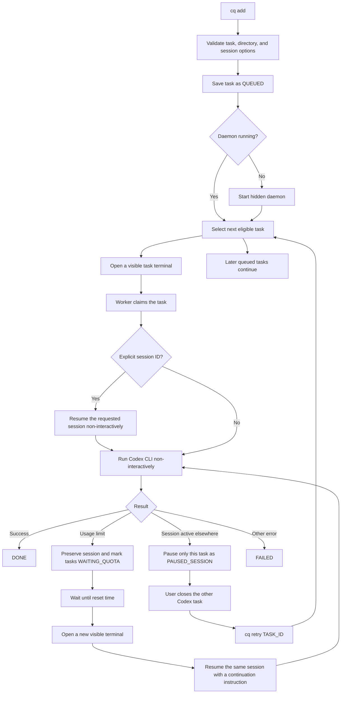

# Codex Queue

`cq` is a small, dependency-free queue for non-interactive Codex tasks.

## Requirements

- Node.js 18 or newer
- Codex CLI installed, authenticated, and available on `PATH`

Verify both commands before installing:

```text
node --version
codex --version
```

## Install

Run `npm link` from this repository, not from the project whose tasks you want to queue.

### Windows

```bat
cd /d C:\path\to\codex-queue
npm link
cq
```

### Ubuntu

```bash
cd /path/to/codex-queue
chmod +x cq.js
npm link
cq
```

No platform-specific dependency is required. The scheduler daemon stays hidden, while each Codex task opens in a visible terminal by default. On a graphical Ubuntu installation, CQ uses the available terminal emulator. On a headless Ubuntu host, task output falls back to `daemon.log`.

## Configuration

Queue data defaults to `.cq` inside the current user's home directory. Set `CQ_HOME` to store it elsewhere.

Windows Command Prompt:

```bat
set CQ_HOME=D:\path\to\cq-data
```

PowerShell:

```powershell
$env:CQ_HOME = "D:\path\to\cq-data"
```

Ubuntu:

```bash
export CQ_HOME=/path/to/cq-data
```

The directory contains:

- `queue.json` — task state
- `daemon.pid` — background daemon process ID
- `daemon.log` — background daemon output and errors

## Usage

Add a new task. The working directory defaults to the current directory:

```text
cq add "Run all tests and fix failures"
cq add "Run all tests and fix failures" --cwd /path/to/project
```

Resume a specific session or the latest session non-interactively:

```text
cq add "Continue the analysis" --session SESSION_ID
cq add "Continue the analysis" --last
```

Both forms use `codex exec resume`. A session has one active writer, so the same session cannot be open in Codex Desktop while CQ runs it. If Desktop owns the session, CQ pauses only that task and later tasks continue.

### Approval modes

Choose a policy when adding a task:

```text
cq add "Deploy the change" --session SESSION_ID --approval ask
cq add "Run the test suite" --approval auto
cq add "Run in a disposable environment" --approval all
```

| Mode | Behavior |
| --- | --- |
| `ask` | Let Codex request approval. Requires an explicit `--session ID`; the task terminal is visible, but `codex exec` remains non-interactive. |
| `auto` | Use Codex automatic approval review inside the workspace-write sandbox. This is the default. |
| `all` | Approve everything by disabling approvals and the sandbox. Use only in an environment you are willing to give full access. |

Change the policy before a task starts:

```text
cq edit TASK_ID --approval ask
cq edit TASK_ID --approval auto
cq edit TASK_ID --approval all
```

Running and completed tasks cannot be edited. Pause or finish them first; CQ never changes an active request's permissions underneath it.

Inspect the daemon and every queued task:

```text
cq list
cq status
```

Retry one paused or failed task, or all paused and failed tasks:

```text
cq retry TASK_ID
cq retry --all
cq edit TASK_ID --approval ask|auto|all
cq done TASK_ID
```

`retry --all` does not touch running, completed, or usage-limited tasks. A session-paused task does not block later queued tasks.

Use `cq done TASK_ID` when a paused task was completed manually in Codex Desktop. CQ cannot safely infer that an unrelated later turn in the same session belongs to the paused queue item.

Other commands:

```text
cq run                 Run one eligible task in the foreground
cq daemon              Run the daemon in the foreground
cq remove TASK_ID      Remove one task
cq clear-done          Remove completed tasks
```

The common `cq deamon` misspelling is accepted as an alias for `cq daemon`.

CQ reads the structured Codex account rate-limit snapshot and schedules `WAITING_QUOTA` tasks for the exhausted window's `resetsAt` time. Text parsing is used only when that snapshot is unavailable, with a ten-minute safety probe only when neither source contains a reset time.

## Visible task terminals

The daemon is a hidden scheduler, but task execution is visible by default. No additional command or option is required:

```text
cq add "Run all tests and fix failures"
```

When the task reaches the front of the queue, CQ opens a terminal titled with the task ID. The terminal shows the original request, session ID, Codex messages, commands, progress, completion, and errors. CQ passes only an internal task ID and one-time worker token on the terminal command line; it reads the actual prompt from the queue file so shell quoting cannot change the request.

Windows asks Windows Terminal to create a separate window and explicitly runs Windows `cmd.exe` followed by the native Node worker. It does not rely on the configured default profile, so a customized default such as WSL cannot change the worker into a Linux process. If Windows Terminal is unavailable, CQ falls back to a new native console window. Graphical Ubuntu systems try `$TERMINAL`, `x-terminal-emulator`, GNOME Terminal, Konsole, Kitty, Alacritty, and xterm. If no graphical terminal is available, execution continues in the background and writes to `daemon.log` so existing headless workflows keep working.

Closing a task terminal interrupts only that task. CQ records the unexpected worker exit as `FAILED`; other queue entries remain available, and the failed task can be resumed with the existing `cq retry TASK_ID` command.

If quota is exhausted after work has started, CQ preserves the original request and the captured session ID. At the reset time it opens another visible terminal, resumes that same session, and sends a short continuation instruction. Ordinary tasks added with `--session` still receive exactly the prompt supplied by the user; CQ adds continuation wording only after a run was interrupted by quota.

The daemon records the CQ source version it loaded. If CQ is updated while a task is running, that task is allowed to finish under its original daemon. The daemon then restarts itself before selecting another task, so newly installed terminal behavior applies without interrupting an active Codex session. `cq list` reports `UPDATE PENDING` for a legacy or outdated daemon and shows the background log path for the task that is already running.

## Task states

| State | Meaning | What to do |
| --- | --- | --- |
| `QUEUED` | Ready to run | Nothing |
| `DISPATCHED` | A visible task terminal is opening | Wait for the worker to start |
| `RUNNING` | Codex is executing the task | Nothing |
| `WAITING_QUOTA` | The account usage limit was reached | Wait; retry is automatic at the displayed time |
| `PAUSED_SESSION` | The session is open in another Codex process | Fully quit Codex Desktop or the terminal that owns it, then run the displayed `cq retry TASK_ID` command |
| `DONE` | Task completed successfully | Optionally run `cq clear-done` |
| `FAILED` | Codex exited with another error | Fix the cause, then run `cq retry TASK_ID` |

## Processing flow



## Troubleshooting

### `npm error enoent ... package.json`

Run `npm link` from the `codex-queue` directory. The target project does not need a `package.json`.

### A session is paused

`cq list` prints the session conflict and the exact retry command. Fully quit Codex Desktop or the other terminal that owns the session before retrying it. The visible CQ task terminal is the supported way to monitor an automatic run. If you need interactive control, wait for CQ to release the session and run `codex resume SESSION_ID` directly.

### The daemon stops

`cq add` starts it automatically. `cq list` also restarts it when runnable work exists. Inspect `daemon.log` under `CQ_HOME` for errors.

### No task terminal opens on Ubuntu

CQ requires `DISPLAY` or `WAYLAND_DISPLAY` and an installed terminal emulator to open a graphical window. On a headless host, the task still runs and writes its output to `daemon.log`.

## Development

```text
npm test
```

The project intentionally uses only Node.js standard-library modules.
