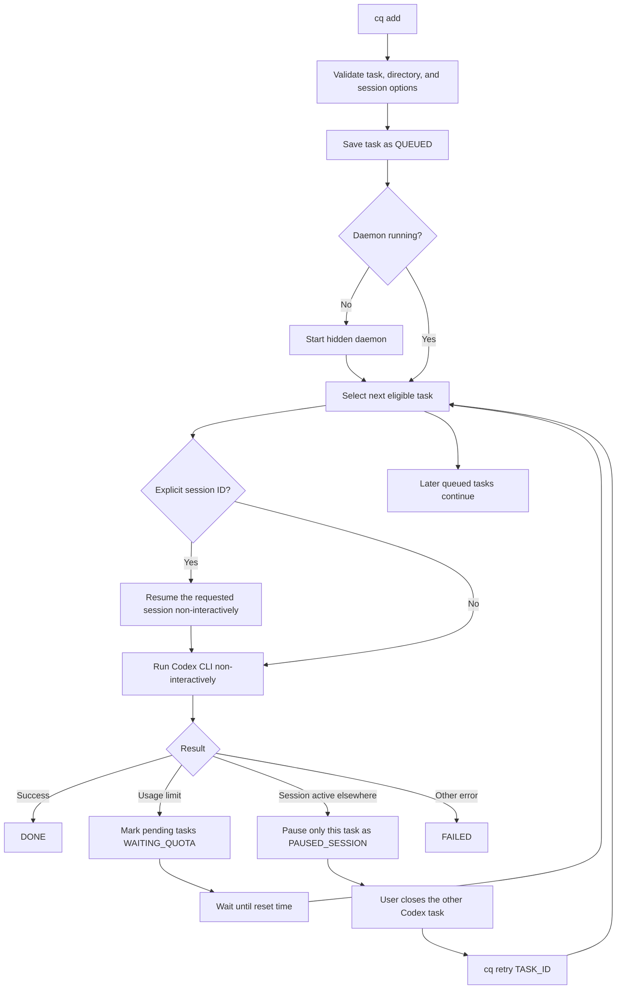

# Codex Queue

`cq` is a small, dependency-free queue for non-interactive Codex tasks.

## Requirements

- Node.js 18 or newer
- Codex CLI installed, authenticated, and available on `PATH`

Verify both commands before installing:

```text
node --version
codex --version
```

## Install

Run `npm link` from this repository, not from the project whose tasks you want to queue.

### Windows

```bat
cd /d C:\path\to\codex-queue
npm link
cq
```

### Ubuntu

```bash
cd /path/to/codex-queue
chmod +x cq.js
npm link
cq
```

No platform-specific dependency is required. Windows uses the npm command shim and hidden processes; Ubuntu uses the executable shebang and detached processes.

## Configuration

Queue data defaults to `.cq` inside the current user's home directory. Set `CQ_HOME` to store it elsewhere.

Windows Command Prompt:

```bat
set CQ_HOME=D:\path\to\cq-data
```

PowerShell:

```powershell
$env:CQ_HOME = "D:\path\to\cq-data"
```

Ubuntu:

```bash
export CQ_HOME=/path/to/cq-data
```

The directory contains:

- `queue.json` — task state
- `daemon.pid` — background daemon process ID
- `daemon.log` — background daemon output and errors

## Usage

Add a new task. The working directory defaults to the current directory:

```text
cq add "Run all tests and fix failures"
cq add "Run all tests and fix failures" --cwd /path/to/project
```

Resume a specific session or the latest session non-interactively:

```text
cq add "Continue the analysis" --session SESSION_ID
cq add "Continue the analysis" --last
```

Both forms use `codex exec resume`. A session has one active writer, so the same session cannot be open in Codex Desktop while CQ runs it. If Desktop owns the session, CQ pauses only that task and later tasks continue.

### Approval modes

Choose a policy when adding a task:

```text
cq add "Deploy the change" --session SESSION_ID --approval ask
cq add "Run the test suite" --approval auto
cq add "Run in a disposable environment" --approval all
```

| Mode | Behavior |
| --- | --- |
| `ask` | Let Codex request approval. Requires an explicit `--session ID`; a hidden non-interactive run cannot be taken over in Desktop. |
| `auto` | Use Codex automatic approval review inside the workspace-write sandbox. This is the default. |
| `all` | Approve everything by disabling approvals and the sandbox. Use only in an environment you are willing to give full access. |

Change the policy before a task starts:

```text
cq edit TASK_ID --approval ask
cq edit TASK_ID --approval auto
cq edit TASK_ID --approval all
```

Running and completed tasks cannot be edited. Pause or finish them first; CQ never changes an active request's permissions underneath it.

Inspect the daemon and every queued task:

```text
cq list
cq status
```

Retry one paused or failed task, or all paused and failed tasks:

```text
cq retry TASK_ID
cq retry --all
cq edit TASK_ID --approval ask|auto|all
cq done TASK_ID
```

`retry --all` does not touch running, completed, or usage-limited tasks. A session-paused task does not block later queued tasks.

Use `cq done TASK_ID` when a paused task was completed manually in Codex Desktop. CQ cannot safely infer that an unrelated later turn in the same session belongs to the paused queue item.

Other commands:

```text
cq run                 Run one eligible task in the foreground
cq daemon              Run the daemon in the foreground
cq remove TASK_ID      Remove one task
cq clear-done          Remove completed tasks
```

The common `cq deamon` misspelling is accepted as an alias for `cq daemon`.

## Task states

| State | Meaning | What to do |
| --- | --- | --- |
| `QUEUED` | Ready to run | Nothing |
| `RUNNING` | Codex is executing the task | Nothing |
| `WAITING_QUOTA` | The account usage limit was reached | Wait; retry is automatic at the displayed time |
| `PAUSED_SESSION` | The session is open in another Codex process | Fully quit Codex Desktop or the terminal that owns it, then run the displayed `cq retry TASK_ID` command |
| `DONE` | Task completed successfully | Optionally run `cq clear-done` |
| `FAILED` | Codex exited with another error | Fix the cause, then run `cq retry TASK_ID` |

## Processing flow



## Troubleshooting

### `npm error enoent ... package.json`

Run `npm link` from the `codex-queue` directory. The target project does not need a `package.json`.

### A session is paused

`cq list` prints the session conflict and the exact retry command. Fully quit Codex Desktop or the terminal that owns the session before retrying it. Reopen Desktop after CQ finishes. If you need live interaction and permission prompts, run `codex resume SESSION_ID` directly instead of using the hidden queue.

### The daemon stops

`cq add` starts it automatically. `cq list` also restarts it when runnable work exists. Inspect `daemon.log` under `CQ_HOME` for errors.

## Development

```text
npm test
```

The project intentionally uses only Node.js standard-library modules.
